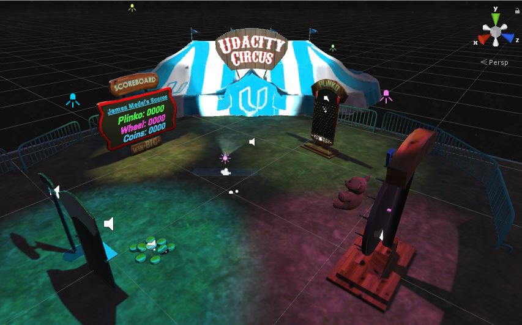

# Udacity Carnival Starter Project

This project is part of [Udacity](https://www.udacity.com "Udacity - Be in demand")'s [VR Developer Nanodegree](https://www.udacity.com/course/vr-developer-nanodegree--nd017).

## Versions
- [Unity 2017.2.0f3](https://unity3d.com/unity/whats-new/unity-2017.2.0)
- [GVR Unity SDK v1.70.0](https://github.com/googlevr/gvr-unity-sdk/releases/tag/1.70.0)

## Summary

The Udacity Carnival consists of 3 Mini-Games: Plinko, Wheel of Fortune, and Coin Toss. With each game, you earn points. When you earn 2000 points, you will receive a virtual classic Carnival prize!

## Open Project In Unity

- Open Unity, then press Unity's **Open** button, select the
**Udacity-Carnival**.

## Customized Pre-existing Udacity Carnival Project

- **Personalized Scoreboard text:**
  - Title set to `James Medel's Scores` instead of the original
  `Udacity's Scores`

- **Aligned Scoreboard text:**
  - `Font size set to 2`
  - So, no part of the text appears outside of the black area of the Scoreboard

- **Customized Coin Toss Game:**
  - `Min Toss Power set to 10`
  - `Max Toss Power set to 13`
    - (Recommended in the answer from the Navigation Quiz)
  - So, now the player can actually score points instead of the coin
  just falling to the ground
  - _How to Play_
    - Hover the circle on the coins, then tap your screen, aim the coin
    at the center of the CoinToss booth and tap your screen to launch the coin

- **Customized Wheel of Fortune Game:**
  - Point values are higher for `smaller wedges (Ex: 750, 500)`
  - Point values are lower for `larger wedges (Ex: 100, 250)`
  - Point values fit within the edges of the wedge
  - _How to Play_
    - Hover the circle in the center of the
      wheel, then tap the screen and the wheel will spin and then land on one of
      the wedges.

- **Customized Plinko Game:**
  - `Oscillation Distance set to 0.7`
    - (Recommended in the answer from the Wiring Up Quiz)
  - _How to Play_
    - Hover the circle to the Plinko booth, you'll notice a ball is oscillating
    left and right, tap the screen when you want to release the ball.

- **Positioned the Teddy Bear:**
  - `Position set to X = 0.01, Y = 4.5, Z = 10.14`
  - So, now Teddy Bear doesn't land on player when it's dropped as a reward
  - The Teddy Bear appears in the Carnival once you win 2000 points in any game,
  it will land in front of the Wheel of Fortune

## Building the App to Android (Samsung Galaxy S8)

- **Unity App Running on Samsung Galaxy S8 Phone**
  - Shows changed values on the Wheel of Fortune. For example, the larger wedges
  have small point values, such as 100 while the small wedges have larger point
  values, such as 750
  - Now when the player scores 2000, the Teddy Bear falls in
  front of the Wheel of Fortune

- **Build.zip** contains an apk for Android of the Unity Project and can be found in the top folder of this project
